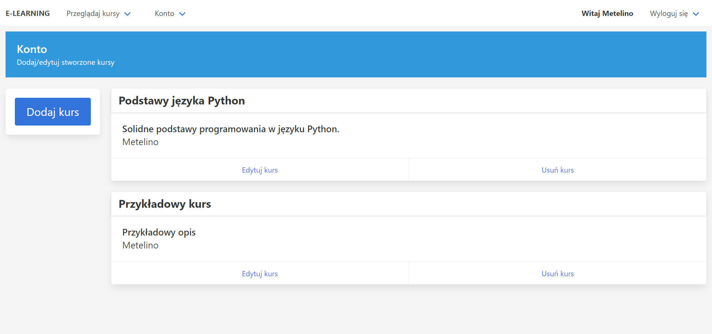
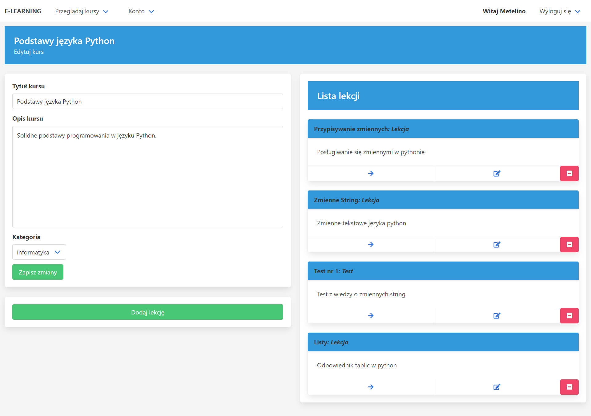
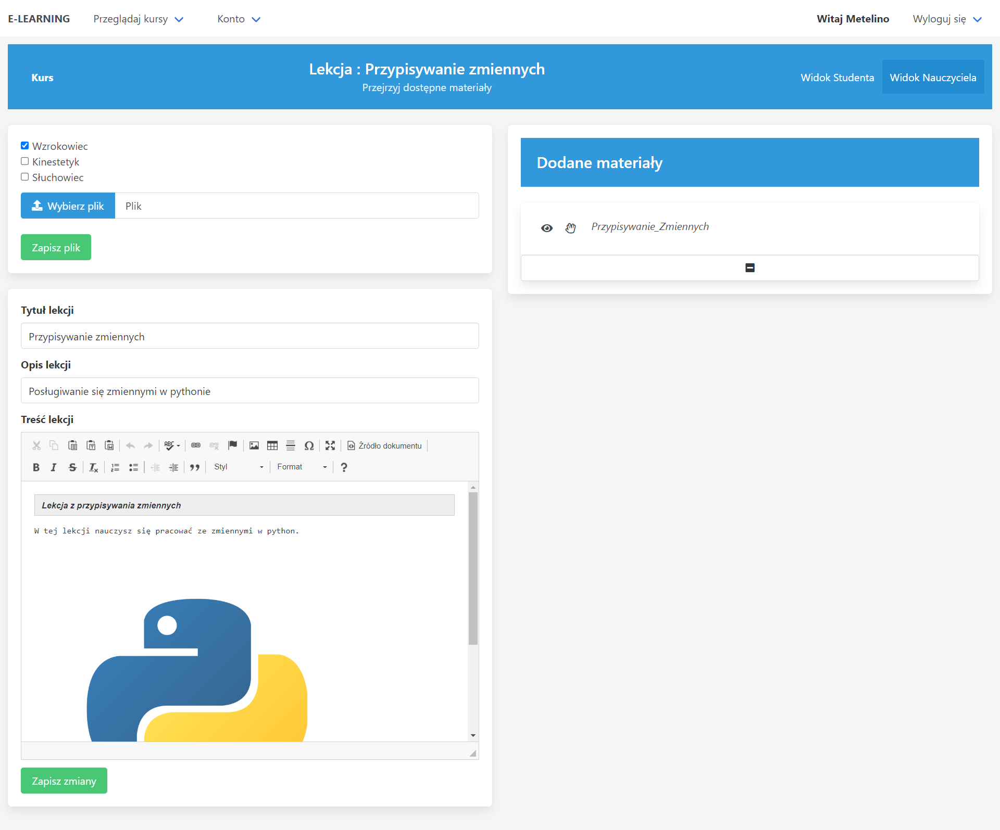
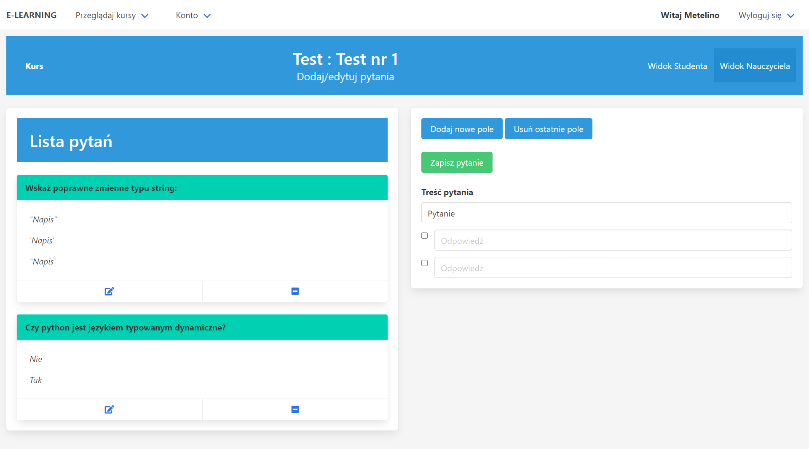
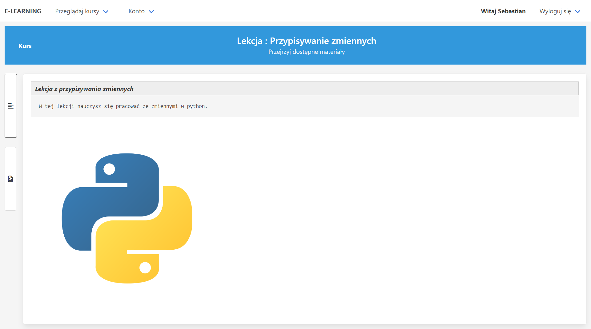
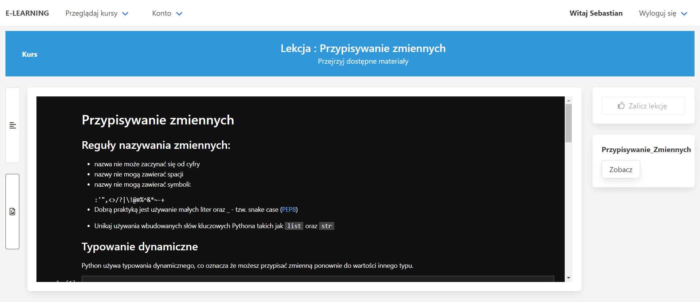
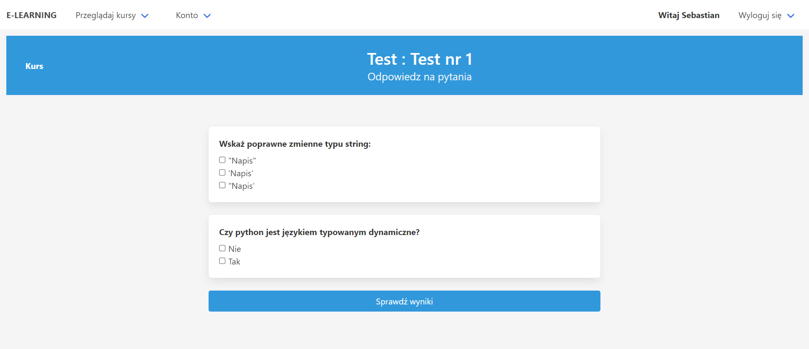

# E-learning platform

Platform for creating courses. Made for college class.

## Table of Contents
* [General Info](#general-information)
* [Technologies Used](#technologies-used)
* [Features](#features)
* [Pictures](#pictures)
* [Setup](#setup)
* [Usage](#usage)

<!-- * [License](#license) -->

## General Information

E-learning platform where learners get different materials based on their VAC learning style.
Staff memebers can create new courses with multiple lessons or tests.
Course creators can add multimedia files to individual lessons assigned to given learning style. 
Users can sign up for a course and pass lessons or tests one by one.

Backend application for purposes of renting cars. 
Application exposes REST API for use for frontend apps. 

## Technologies Used

- Django - version 3.2.7
- Bulma - 0.92
- htmx - 1.3.3
- hyperscript - 0.0.9

## Features

- create account and sign up for courses
- get assigned VAC learning style by solving VAC test (can approach multiple times)
- read notes written by teacher and view materials, unlock next lesson after finishing previous one
- solve multiple-choice tests 
- asynchronous page updates with htmx
- styled with bulma

## Pictures

Edit created courses

Edit course, add lessons/tests

Edit lesson

Edit test

Read teacher notes, uploaded files

 

Solve test

## Setup
To run you need python installed. All project dependencies are listed in requirements.txt.
To install all deps run:\
`pip install -r requirements.txt`\
To start server change directory to folder with manage.py file. Then run:\
`python manage.py runserver`

## Usage
There is created admin profile: <code>Username: Metelino, password: admin</code>\
which can access django admin page.
Admin can give a user staff status which authorizes them to make courses. 
After logging in its simply a matter of using the website functionalities.
